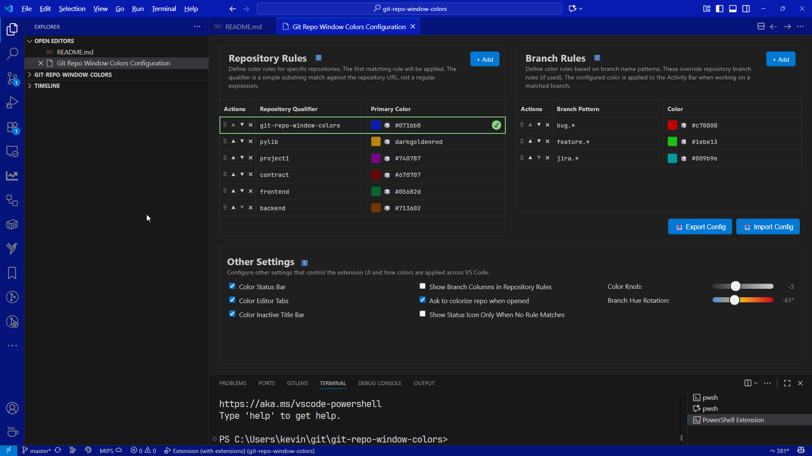

# Git Repo Window Colors

**Never lose track of which repository you're working in again.**

Transform your VS Code experience by automatically applying distinctive colors to your workspace based on the Git repository you have open. Perfect for developers juggling multiple projects, this extension provides instant visual identification across all your VS Code windows.

---

## 🆕 What's New

### 🎨 Modern Configuration Editor

- Brand new visual configuration interface with intuitive rule building
- Drag & drop rule reordering for priority-based matching
- Built-in color picker with support for hex, RGB, HSL, and named colors
- **NEW:** HTML color name autocomplete with visual previews for all 140 standard colors
- Real-time validation and error handling
- Comprehensive accessibility support with keyboard navigation
- Smart tooltips and contextual help throughout the interface

### 📍 Status Bar Icon Integration

- Optional status bar icon (palette symbol)
- Configurable visibility: show always or only when no rules match
- One-click access to configuration editor
- Intelligent hiding for non-Git workspaces
- Seamless integration with existing VS Code UI patterns

### ✨ User Experience Improvements

- Responsive 3-column layout optimized for different screen sizes
- Consistent typography using VS Code terminal font
- Refined spacing and alignment across all UI elements
- Native VS Code confirmation dialogs for destructive actions
- Enhanced keyboard shortcuts and accessibility features
- Import/Export Configurations for easy sharing

---

## ⚡ Configuration Editor



## ⚡ Why You Need This

**The Problem:** You're a productive developer with many VS Code windows open across different repositories. They all look identical. You waste precious seconds (or minutes, or YEARS!) figuring out which window contains which project.

**The Solution:** Automatic, intelligent color-coding that makes every repository instantly recognizable at a glance.

✅ **Instant Recognition** - Spot the right window immediately  
✅ **Zero Manual Work** - Automatic coloring based on Git repository  
✅ **Highly Customizable** - Fine-tune colors for your workflow  
✅ **Branch-Aware** - Different colors for feature branches, hotfixes, etc.  
✅ **Taskbar Integration** - Colored thumbnails in Windows/Mac/Linux dock previews  

---

## 🚀 Quick Start

### 1. Install & Configure (2 minutes)

1. **Install** the extension from VS Code marketplace
2. **Open Command Palette** (`Ctrl+Shift+P` / `Cmd+Shift+P`)
3. **Run:** `GRWC: Open Configuration`
4. **Add your first rule** - Click "+ Add" in Repository Rules
5. **Done!** Your workspace now has a unique color identity
6. **More!** Tune the color to your liking, click on the color swatch

### 2. Recommended VS Code Settings

These global settings are required for the best visual experience:

```json
{
    "window.titleBarStyle": "custom",
    "workbench.colorCustomizations": {
        "window.customTitleBarVisibility": "auto"
    }
}
```

The extension will check these settings an offer to set them for you.

---

## 💡 How It Works

### Repository Rules (Primary Feature)

Configure colors for specific repositories. Rules are matched in priority order:

- **Repository Qualifier:** Part of your repo URL (e.g., `my-project`, `github.com/company/app`)
- **Primary Color:** Main window color for this repository  
- **Branch Color:** [Optional/Legacy] different color for non-default (or default) branches
- **Default Branch:** [Optional/Legacy] Specify your preferred main branch name for branch-specific coloring.
- **Branch Rules:** Check out the Branch Rules section below for a more powerful branch coloring system.

### Branch Rules (Advanced Feature)

Create patterns that work across ALL repositories:

- **Pattern:** Regular expression matching branch names
- **Color:** Applied when pattern matches

**Examples:**

- `feature/.*:purple` → All feature branches, regardless of repository, are purple
- `hotfix.*:red` → All hotfix branches, regardless of repository, are red  
- `JIRA-123.*:orange` → Specific ticket work, regardless of repository, is orange

Just like Repo Rules, you can tune the color to your preferences.

Unlike Repo Rules, which use a simple string.includes pattern, Branch Rules are regular expressions
able to match any complexing branch naming strategy.

---

## 🎨 Configuration Interface

### Modern, Intuitive UI

- **Visual Rule Builder** - No more JSON editing
- **Drag & Drop Reordering** - Priority-based rule matching
- **Built-in Color Picker** - Supports hex, RGB, HSL, named colors
- **HTML Color Autocomplete** - Intelligent suggestions for all 140 standard HTML color names with visual previews
- **Real-time Preview** - See changes instantly
- **Smart Validation** - Catch errors before they break anything

### Color Input Features

When entering colors in text fields, enjoy these productivity features:

- **Smart Autocomplete** - Type any part of a color name (e.g., "blue", "dark", "light") to see matching suggestions
- **Visual Color Preview** - Each autocomplete suggestion includes a color swatch for instant recognition
- **Full HTML Color Support** - Access to all 140 standard colors: aliceblue, antiquewhite, aqua, azure, beige, bisque, black, blue, brown, coral, crimson, cyan, gold, green, hotpink, indigo, lime, magenta, navy, orange, pink, purple, red, silver, teal, violet, white, yellow, and many more
- **Keyboard Navigation** - Use arrow keys to browse suggestions, Enter to select, Escape to close
- **Mouse Support** - Click any suggestion to select it instantly
- **Auto-scroll** - Dropdown automatically scrolls to keep selected items visible
- **Random Color Generator** - If specifying a color is too much work, just roll the dice!

### Keyboard Shortcuts

- `Ctrl+Alt+R` - Add Repository Rule
- `Ctrl+Alt+B` - Add Branch Rule

### Accessibility First

- Full keyboard navigation
- Screen reader compatible
- High contrast support
- Comprehensive help text

---

## 🔧 Command Palette

Quick access to essential functions:

| Command | Purpose |
|---------|---------|
| `GRWC: Open Configuration` | Open full configuration UI *(recommended)* |
| `GRWC: Colorize this repo` | Quick-add current repository with a random color |
| `GRWC: Decolorize this repo` | Remove the rule that colorizes for current repository |
| `GRWC: Export Configuration` | Export all settings to JSON file |
| `GRWC: Import Configuration` | Import settings from JSON file |

---

## ⚙️ Advanced Features

### Smart Color Management

- **Theme Integration** - Works with light and dark themes. When random colors are generated the current theme is considered to ensure that text lables remain readable.

### Status Bar Integration

- **Visual Repository Indicator** - Optional status bar icon with color palette icon (on by default)
- **Smart Visibility Control** - Configure when the icon appears:
  - Always visible for Git repositories, or
  - Only visible when no repository rules match (helps identify unconfigured repos)
  - Hidden for non-Git workspaces automatically
- **One-Click Access** - Click the status icon to open the configuration editor instantly, if the current repository is not configured a new rule will be created for it using a random color that you can then tune.
- **Contextual Information** - Tooltip shows current repository status and rule matching

### Multi-Element Coloring

Configure which VS Code elements get colored:

- Title bar *(primary)*
- Activity bar *(recommended)*
- Editor tabs *(optional)*
- Status bar *(optional)*
- Inactive window title *(optional - but highly recommended)*

### Enterprise Ready

- **Settings Sync Compatible** - Colors follow you across machines
- **Team Friendly** - Configurations don't pollute repository settings (unless you commit .vscode/settings.json to the repo). And you can share common configs across your team.

### Configuration Import/Export 🆕

Perfect for **team collaboration** and **standardizing workspace colors** across your organization:

- **Export Complete Configuration** - Save all your repository rules, branch patterns, and settings to a JSON file
- **Automatic Date Stamping** - Exported files include YYMMDD timestamp for easy organization, but feel free to rename it.
- **Smart Import Options** - Choose to replace existing configuration or merge with current settings
- **Team Setup Repository** - Commit configuration files to a shared team repository for consistent colors across all team members
- **One-Click Access** - Import/Export buttons available directly in the configuration interface

**Team Workflow Example:**

1. Team lead configures colors for all company repositories
2. Exports configuration to `team-colors-config-241004.json`
3. Commits the config file to team setup repository
4. Team members import the configuration for instant consistency
5. Everyone has the same visual repository identification system

---

## 📊 Perfect For

- **Full-stack Developers** working across frontend/backend/other repos
- **DevOps Engineers** managing multiple infrastructure projects  
- **Open Source Contributors** juggling personal and work projects
- **Team Leads** reviewing code across multiple repositories
- **Consultants** switching between client projects

---

## 🛠️ Troubleshooting

**Colors not applying?** Check the "Git Repo Window Colors" output channel for diagnostic information.

**Multiple windows same color?** Ensure your repository qualifiers are specific enough to differentiate repositories.

---

## 💬 Support

**Found a bug?** Include output from the "Git Repo Window Colors" channel in your issue report.

**Feature request?** We're always looking to make developers more productive!

---

*Transform your workflow. Install Git Repo Window Colors today and never lose track of your projects again.*

If this extension saves you time and frustration, consider [buying me a coffee](https://www.buymeacoffee.com/KevinMills) ☕
